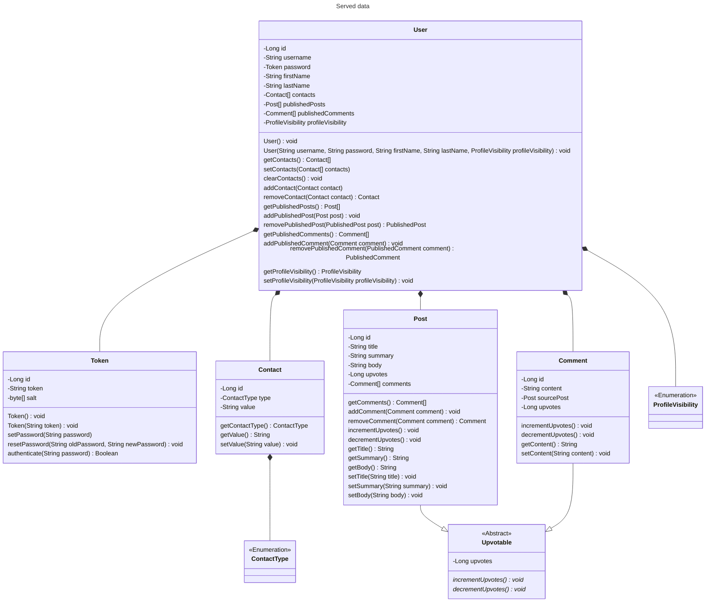

# Description
This final project consists of a RESTful API to be deployed in Railway.

The served data is modeled based on StackOverflow inspirations.

```mermaid
---
title: Served data
---
classDiagram
    User *-- Token
    User *-- Contact
    User *-- Post
    User *-- Comment
    User *-- ProfileVisibility

    Post --|> Upvotable
    Comment --|> Upvotable

    Contact *-- ContactType

    class User {
        -Long id
        -String username
        -Token password
        -String firstName
        -String lastName
        -Contact[] contacts
        -Post[] publishedPosts
        -Comment[] publishedComments
        -ProfileVisibility profileVisibility

        User() void
        User(String username, String password, String firstName, String lastName, ProfileVisibility profileVisibility) void

        getContacts() Contact[]
        setContacts(Contact[] contacts)
        clearContacts() void
        addContact(Contact contact)
        removeContact(Contact contact) Contact

        getPublishedPosts() Post[]
        addPublishedPost(Post post) void
        removePublishedPost(PublishedPost post) PublishedPost

        getPublishedComments() Comment[]
        addPublishedComment(Comment comment) void
        removePublishedComment(PublishedComment comment) PublishedComment

        getProfileVisibility() ProfileVisibility
        setProfileVisibility(ProfileVisibility profileVisibility) void
    }

    class Contact {
        -Long id
        -ContactType type
        -String value

        getContactType() ContactType
        getValue() String
        setValue(String value) void
    }

    class Token {
        -Long id
        -String token
        -byte[] salt
        
        Token() void
        Token(String token) void
        setPassword(String password)
        resetPassword(String oldPassword, String newPassword) void
        authenticate(String password) Boolean
    }

    class Post {
        -Long id
        -String title
        -String summary
        -String body
        -Long upvotes
        -Comment[] comments

        getComments() Comment[]
        addComment(Comment comment) void
        removeComment(Comment comment) Comment

        incrementUpvotes() void
        decrementUpvotes() void

        getTitle() String
        getSummary() String
        getBody() String
        setTitle(String title) void
        setSummary(String summary) void
        setBody(String body) void
    }

    class Comment {
        -Long id
        -String content
        -Post sourcePost
        -Long upvotes

        incrementUpvotes() void
        decrementUpvotes() void

        getContent() String
        setContent(String content) void
    }

    class Upvotable {
        -Long upvotes

        incrementUpvotes() void*
        decrementUpvotes() void*
    }
    <<Abstract>> Upvotable

    class ProfileVisibility
    <<Enumeration>> ProfileVisibility

    class ContactType
    <<Enumeration>> ContactType
```
